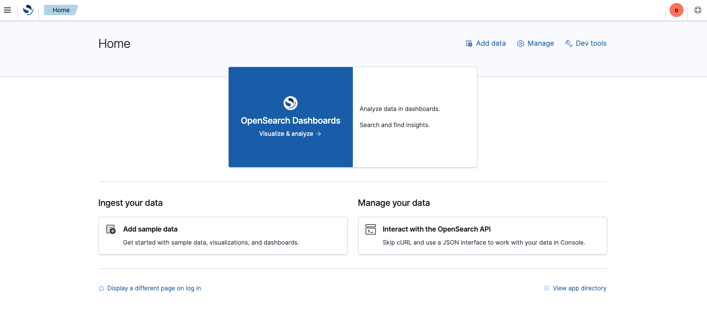

The `/docs/opensearch-dashboards/` redirect is specifically to support the UI links in OpenSearch Dashboards 1.0.0.

# Getting started with OpenSearch Dashboards

OpenSearch Dashboards is the preferred visualization platform for analyzing data in OpenSearch. It serves as the user interface for many openSearch features, including security, alerting, index state management, SQL, and more.

Out-of-the-box OpenSearch Dashboards includes several tools for discovering and visualizing data, and OpenSearch provides a full suite of plugins that you can use to monitor events, identify trends, and automate recurring activities.

# Try OpenSearch Dashboards
You can try OpenSearch Dashboards' features in the [OpenSearch Dashboards Playground](https://playground.opensearch.org/app/home).

Choose **OpenSearch Dashboards > Dashboards > Create dashboard** and explore the sample Global Flight, Web Traffic, and Revenue dashboards.

# OpenSearch Dashboards for your use case

OpenSearch Dashboards makes it easy to visualize data for a number of use cases such as log analytics, application search, enterprise search, and more. Here are a few examples.  

<table>
<thead>
</thead>
<tbody>
<tr>
<td>Visualize log and trace data with interactive log analytics</td>
<td>Centralize and analyze logs for real-time threat detection and incident management</td>
</tr>
<tr>
<td>Quickly find relvant data within your applications, websites, and data catalogs</td>
<td>Find and fix problems and improve application health at a glance</td>
</tr>
</tbody>
</table>

# Install and create OpenSearch Dashboards

After installing OpenSearch, you can install OpenSearch Dashboards, with different installation methods to choose. For more information, see [OpenSearch Installation Instructions](https://opensearch.org/docs/latest/opensearch/install/index/).

You can follow these steps to create a dashboard using sample data. 

1. After installing OpenSearch Dashboards, open it at [http://localhost:5601](http://localhost:5601/app/home#/).
2. Select **Add sample data**, and select **Add data** for the sample  flight data dataset. 
3. From the top menu, choose **Discover** and search for a few flights.
4. Choose **Dashboard**, **[Flights]** Global Flight Dashboard.

Your dashboard will look different than the example below.

# Related links

- [Upgrade from Kibana OSS to OpenSearch Dashboards](https://opensearch.org/docs/latest/upgrade-to/dashboards-upgrade-to/)
- [OpenSearch Frequently Asked Questions](https://opensearch.org/faq/)