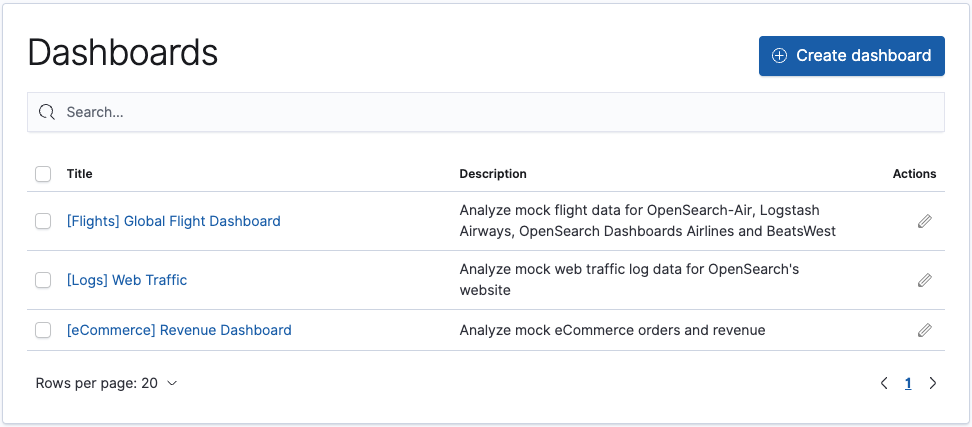

The `/docs/opensearch-dashboards/` redirect is specifically to support the UI links in OpenSearch Dashboards 1.0.0.

# What is OpenSearch Dashboards?

OpenSearch Dashboards is an open-source analytics and search application that gives you an overview of the reports and metrics you care about most. It displays multiple visualizations that work together on a single screen, giving you a centralized and comprehensive view of your data and providing key insights for at-a-glance decision-making.

OpenSearch Dashboards allows you to create several types of dashboards for many different purposes. Some of the ways you can use OpenSearch Dashboards include the following:  

* See an all-in-one view of the data you need to make informed decisions.
* Search, explore, filter, aggregate, and visualize your data in near real time.
* Track and monitor the most important information about your day-to-day operations. 
* Schedule, export, and share reports from dashboards, saved searches, alerts, and visualizations. 

OpenSearch Dashboards is designed to be easily used and understood by a variety of users both within and outside your organization, such as business analysts, senior executives, engineering managers, and operations managers.  

## Try OpenSearch Dashboards
You can try OpenSearch Dashboards' features in the [OpenSearch Dashboards Playground](_https://playground.opensearch.org/app/home_).

Choose **OpenSearch Dashboards > Dashboards > Create dashboard** and explore the sample Global Flight, Web Traffic, and Revenue dashboards.

## OpenSearch Dashboards for your use case

<table>
<thead>
</thead>
<tbody>
<tr>
<td>Analyze your log files</td>
<td>Deduce security vulnerabilities</td>
</tr>
<tr>
<td>See patterns in your data</td>
<td>Find the most popular products on your site</td>
</tr>
</tbody>
</table>

## Installing OpenSearch Dashboards

The basic installation of Dashboards includes the following features:
- [Discover](https://github.com/opensearch-project/documentation-website/issues/991): Lets you see the OpenSearch data.
- [Visualize](https://github.com/opensearch-project/documentation-website/issues/992): Lets you create visualizations for the data.
- [Dashboard](https://github.com/opensearch-project/documentation-website/issues/941): Displays multiple visualizations on a dashboard.

The default installation of Dashboards includes a full suite of [OpenSearch plugin]({{site.url}}{{site.baseurl}}/) features that lets you monitor events, identify trends, and automate recurring activities.

For more information, see [OpenSearch Installation Instructions]({{site.url}}{{site.baseurl}}/).

## Create a dashboard using sample data*
Use the following steps to create a dashboard using sample data. Your dashboard may look different than the examples below.
1. Open OpenSearch Dashboards in the OpenSearch Dashboards Playground.
2. Select **Add sample data**, and select **Add data.**  
3. Choose **Discover** and search for a few flights.
4. Choose **Dashboard**, **[Flights]** Global Flight Dashboard.
5.  Click the **Save** icon left of the **Search** field to save the dashboard.
6.  Add a descriptive name, and then click **Save.**

You have created your dashboard, and it is displaying results.

## Compatibility with Elasticsearch
You can use OpenSearch Dashboards with an Elasticsearch backend 7.10 or lower. Elastic users may benefit from Dashboards' additional functionality provided by a growing ecosystem of OpenSearch plugins. For more information, see the [_feature comparison of Opensearch Dashboards and Kibana_](_{{site.url}}{{site.baseurl}}_).  See [_Upgrade from Kibana OSS to OpenSearch Dashboards_](_{{site.url}}{{site.baseurl}}/upgrade-to/dashboards-upgrade-to_) for instructions to switch to OpenSearch Dashboards.